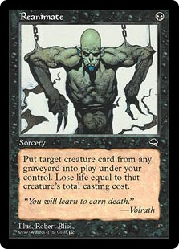

# Rakdos Reanimator #

Source: [Rakdos Reanimator](https://www.mtggoldfish.com/deck/1793991#paper)

## Main Deck ##
|   |   |
|---|-----
| 1 | Ashen Rider
| 4 | Chancellor of the Annex
| 4 | Griselbrand
| 1 | Tidespout Tyrant
|   |   |
| 4 | Dark Ritual
| 4 | Entomb
|   |   |
| 4 | Cabal Therapy
| 4 | Exhume
| 4 | Faithless Looting
| 4 | Reanimate
| 4 | Thoughtseize
|   |   |
| 4 | Animate Dead
|   |   |
| 4 | Lotus Petal
|   |   |
| 2 | Blood Crypt
| 4 | Bloodstained Mire
| 2 | Overgrown Tomb
| 1 | Polluted Delta
| 2 | Swamp
| 3 | Wooded Foothills

## Sideboard ##
|   |   |
|---|-----
| 1 | Archetype of Endurance
| 1 | Avacyn, Angel of Hope
| 1 | Elesh Norn, Grand Cenobite
| 1 | Gisela, Blade of Goldnight
| 1 | Iona, Shield of Emeria
| 1 | It That Betrays
| 1 | Magmatic Force
| 1 | Pathrazer of Ulamog
| 1 | Rune-Scarred Demon
| 1 | Sire of Stagnation
| 1 | Sphinx of the Steel Wind
|   |   |
| 2 | Abrupt Decay
|   |   |
| 2 | Tormod's Crypt
